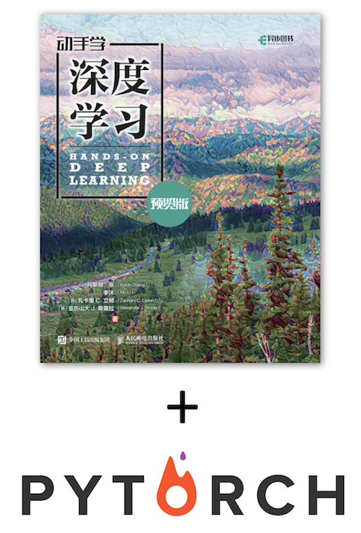

<div align=center>

</div>

本项目将[《动手学深度学习》](http://zh.d2l.ai/) 原书中MXNet代码实现改为PyTorch实现。原书作者：阿斯顿·张、李沐、扎卡里 C. 立顿、亚历山大 J. 斯莫拉以及其他社区贡献者，GitHub地址：https://github.com/d2l-ai/d2l-zh

此书的[中](https://zh.d2l.ai/)[英](https://d2l.ai/)版本存在一些不同，针对此书英文版的PyTorch重构可参考[这个项目](https://github.com/dsgiitr/d2l-pytorch)。
There are some differences between the [Chinese](https://zh.d2l.ai/) and [English](https://d2l.ai/) versions of this book. For the PyTorch modifying of the English version, you can refer to [this repo](https://github.com/dsgiitr/d2l-pytorch).


## 简介
本仓库主要包含code和docs两个文件夹（外加一些数据和图片存放在data和img中）。其中code文件夹就是每章相关jupyter notebook代码（基于PyTorch）；docs文件夹就是markdown格式的《动手学深度学习》书中的相关内容，由于原书使用的是MXNet框架，所以docs内容可能与原书略有不同，但是整体内容是一样的。欢迎对本项目做出贡献或提出issue。

> 注：本仓库包含一些公式，但是github的markdown原生是不支持公式显示的，Chrome用户可以安装这个[在github上显示公式的插件](https://chrome.google.com/webstore/detail/mathjax-plugin-for-github/ioemnmodlmafdkllaclgeombjnmnbima)，但还是建议clone到本地用常用的markdown应用查看。所有章节更新完毕后会考虑新增pdf版本，欢迎关注。

## 面向人群
本项目面向对深度学习感兴趣，尤其是想使用PyTorch进行深度学习的童鞋。本项目并不要求你有任何深度学习或者机器学习的背景知识，你只需了解基础的数学和编程，如基础的线性代数、微分和概率，以及基础的Python编程。

## 目录
### [1. 深度学习简介](https://github.com/ShusenTang/Dive-into-DL-PyTorch/blob/master/docs/chapter01_DL-intro/deep-learning-intro.md)
### 2. 预备知识
[2.1 环境配置](https://github.com/ShusenTang/Dive-into-DL-PyTorch/blob/master/docs/chapter02_prerequisite/2.1_install.md)   
[2.2 数据操作](https://github.com/ShusenTang/Dive-into-DL-PyTorch/blob/master/docs/chapter02_prerequisite/2.2_tensor.md)   
[2.3 自动求梯度](https://github.com/ShusenTang/Dive-into-DL-PyTorch/blob/master/docs/chapter02_prerequisite/2.3_autograd.md)    
### 3. 深度学习基础
[3.1 线性回归](https://github.com/ShusenTang/Dive-into-DL-PyTorch/blob/master/docs/chapter03_DL-basics/3.1_linear-regression.md)    
[3.2 线性回归的从零开始实现](https://github.com/ShusenTang/Dive-into-DL-PyTorch/blob/master/docs/chapter03_DL-basics/3.2_linear-regression-scratch.md)     
[3.3 线性回归的简洁实现](https://github.com/ShusenTang/Dive-into-DL-PyTorch/blob/master/docs/chapter03_DL-basics/3.3_linear-regression-pytorch.md)    
[3.4 softmax回归](https://github.com/ShusenTang/Dive-into-DL-PyTorch/blob/master/docs/chapter03_DL-basics/3.4_softmax-regression.md)     
[3.5 图像分类数据集（Fashion-MNIST）](https://github.com/ShusenTang/Dive-into-DL-PyTorch/blob/master/docs/chapter03_DL-basics/3.5_fashion-mnist.md)    
[3.6 softmax回归的从零开始实现](https://github.com/ShusenTang/Dive-into-DL-PyTorch/blob/master/docs/chapter03_DL-basics/3.6_softmax-regression-scratch.md)      
[3.7 softmax回归的简洁实现](https://github.com/ShusenTang/Dive-into-DL-PyTorch/blob/master/docs/chapter03_DL-basics/3.7_softmax-regression-pytorch.md)      
[3.8 多层感知机](https://github.com/ShusenTang/Dive-into-DL-PyTorch/blob/master/docs/chapter03_DL-basics/3.8_mlp.md)       
[3.9 多层感知机的从零开始实现](https://github.com/ShusenTang/Dive-into-DL-PyTorch/blob/master/docs/chapter03_DL-basics/3.9_mlp-scratch.md)      
[3.10 多层感知机的简洁实现](https://github.com/ShusenTang/Dive-into-DL-PyTorch/blob/master/docs/chapter03_DL-basics/3.10_mlp-pytorch.md)      
[3.11 模型选择、欠拟合和过拟合](https://github.com/ShusenTang/Dive-into-DL-PyTorch/blob/master/docs/chapter03_DL-basics/3.11_underfit-overfit.md)      
[3.12 权重衰减](https://github.com/ShusenTang/Dive-into-DL-PyTorch/blob/master/docs/chapter03_DL-basics/3.12_weight-decay.md)    
[3.13 丢弃法](https://github.com/ShusenTang/Dive-into-DL-PyTorch/blob/master/docs/chapter03_DL-basics/3.13_dropout.md)    
[3.14 正向传播、反向传播和计算图](https://github.com/ShusenTang/Dive-into-DL-PyTorch/blob/master/docs/chapter03_DL-basics/3.14_backprop.md)      
[3.15 数值稳定性和模型初始化](https://github.com/ShusenTang/Dive-into-DL-PyTorch/blob/master/docs/chapter03_DL-basics/3.15_numerical-stability-and-init.md)       
[3.16 实战Kaggle比赛：房价预测](https://github.com/ShusenTang/Dive-into-DL-PyTorch/blob/master/docs/chapter03_DL-basics/3.16_kaggle-house-price.md)         
### 4. 深度学习计算
[4.1 模型构造](https://github.com/ShusenTang/Dive-into-DL-PyTorch/blob/master/docs/chapter04_DL_computation/4.1_model-construction.md)       
[4.2 模型参数的访问、初始化和共享](https://github.com/ShusenTang/Dive-into-DL-PyTorch/blob/master/docs/chapter04_DL_computation/4.2_parameters.md)      
[4.3 模型参数的延后初始化](https://github.com/ShusenTang/Dive-into-DL-PyTorch/blob/master/docs/chapter04_DL_computation/4.3_deferred-init.md)      
[4.4 自定义层](https://github.com/ShusenTang/Dive-into-DL-PyTorch/blob/master/docs/chapter04_DL_computation/4.4_custom-layer.md)    
[4.5 读取和存储](https://github.com/ShusenTang/Dive-into-DL-PyTorch/blob/master/docs/chapter04_DL_computation/4.5_read-write.md)   
[4.6 GPU计算](https://github.com/ShusenTang/Dive-into-DL-PyTorch/blob/master/docs/chapter04_DL_computation/4.6_use-gpu.md)    
### 5. 卷积神经网络
[5.1 二维卷积层](https://github.com/ShusenTang/Dive-into-DL-PyTorch/blob/master/docs/chapter05_CNN/5.1_conv-layer.md)     
[5.2 填充和步幅](https://github.com/ShusenTang/Dive-into-DL-PyTorch/blob/master/docs/chapter05_CNN/5.2_padding-and-strides.md)     
[5.3 多输入通道和多输出通道](https://github.com/ShusenTang/Dive-into-DL-PyTorch/blob/master/docs/chapter05_CNN/5.3_channels.md)    
[5.4 池化层](https://github.com/ShusenTang/Dive-into-DL-PyTorch/blob/master/docs/chapter05_CNN/5.4_pooling.md)    
[5.5 卷积神经网络（LeNet）](https://github.com/ShusenTang/Dive-into-DL-PyTorch/blob/master/docs/chapter05_CNN/5.5_lenet.md)    
[5.6 深度卷积神经网络（AlexNet）](https://github.com/ShusenTang/Dive-into-DL-PyTorch/blob/master/docs/chapter05_CNN/5.6_alexnet.md)    
[5.7 使用重复元素的网络（VGG）](https://github.com/ShusenTang/Dive-into-DL-PyTorch/blob/master/docs/chapter05_CNN/5.7_vgg.md)     
[5.8 网络中的网络（NiN）](https://github.com/ShusenTang/Dive-into-DL-PyTorch/blob/master/docs/chapter05_CNN/5.8_nin.md)     
[5.9 含并行连结的网络（GoogLeNet）](https://github.com/ShusenTang/Dive-into-DL-PyTorch/blob/master/docs/chapter05_CNN/5.9_googlenet.md)       
[5.10 批量归一化](https://github.com/ShusenTang/Dive-into-DL-PyTorch/blob/master/docs/chapter05_CNN/5.10_batch-norm.md)     
[5.11 残差网络（ResNet）](https://github.com/ShusenTang/Dive-into-DL-PyTorch/blob/master/docs/chapter05_CNN/5.11_resnet.md)      
[5.12 稠密连接网络（DenseNet）](https://github.com/ShusenTang/Dive-into-DL-PyTorch/blob/master/docs/chapter05_CNN/5.12_densenet.md)    
### 6. 循环神经网络
[6.1 语言模型](https://github.com/ShusenTang/Dive-into-DL-PyTorch/blob/master/docs/chapter06_RNN/6.1_lang-model.md)    
[6.2 循环神经网络](https://github.com/ShusenTang/Dive-into-DL-PyTorch/blob/master/docs/chapter06_RNN/6.2_rnn.md)    
[6.3 语言模型数据集（周杰伦专辑歌词）](https://github.com/ShusenTang/Dive-into-DL-PyTorch/blob/master/docs/chapter06_RNN/6.3_lang-model-dataset.md)    
[6.4 循环神经网络的从零开始实现](https://github.com/ShusenTang/Dive-into-DL-PyTorch/blob/master/docs/chapter06_RNN/6.4_rnn-scratch.md)             
[6.5 循环神经网络的简洁实现](https://github.com/ShusenTang/Dive-into-DL-PyTorch/blob/master/docs/chapter06_RNN/6.5_rnn-pytorch.md)              
[6.6 通过时间反向传播](https://github.com/ShusenTang/Dive-into-DL-PyTorch/blob/master/docs/chapter06_RNN/6.6_bptt.md)     
[6.7 门控循环单元（GRU）](https://github.com/ShusenTang/Dive-into-DL-PyTorch/blob/master/docs/chapter06_RNN/6.7_gru.md)              
[6.8 长短期记忆（LSTM）](https://github.com/ShusenTang/Dive-into-DL-PyTorch/blob/master/docs/chapter06_RNN/6.8_lstm.md)      
[6.9 深度循环神经网络](https://github.com/ShusenTang/Dive-into-DL-PyTorch/blob/master/docs/chapter06_RNN/6.9_deep-rnn.md)              
[6.10 双向循环神经网络](https://github.com/ShusenTang/Dive-into-DL-PyTorch/blob/master/docs/chapter06_RNN/6.10_bi-rnn.md)   

### 7. 优化算法
[7.1 优化与深度学习](https://github.com/ShusenTang/Dive-into-DL-PyTorch/blob/master/docs/chapter07_optimization/7.1_optimization-intro.md)              
[7.2 梯度下降和随机梯度下降](https://github.com/ShusenTang/Dive-into-DL-PyTorch/blob/master/docs/chapter07_optimization/7.2_gd-sgd.md)       
[7.3 小批量随机梯度下降](https://github.com/ShusenTang/Dive-into-DL-PyTorch/blob/master/docs/chapter07_optimization/7.3_minibatch-sgd.md)         
[7.4 动量法](https://github.com/ShusenTang/Dive-into-DL-PyTorch/blob/master/docs/chapter07_optimization/7.4_momentum.md)      
[7.5 AdaGrad算法](https://github.com/ShusenTang/Dive-into-DL-PyTorch/blob/master/docs/chapter07_optimization/7.5_adagrad.md)     
[7.6 RMSProp算法](https://github.com/ShusenTang/Dive-into-DL-PyTorch/blob/master/docs/chapter07_optimization/7.6_rmsprop.md)       
[7.7 AdaDelta算法](https://github.com/ShusenTang/Dive-into-DL-PyTorch/blob/master/docs/chapter07_optimization/7.7_adadelta.md)      
[7.8 Adam算法](https://github.com/ShusenTang/Dive-into-DL-PyTorch/blob/master/docs/chapter07_optimization/7.8_adam.md)  

### 8. 计算性能
[8.1 命令式和符号式混合编程](https://github.com/ShusenTang/Dive-into-DL-PyTorch/blob/master/docs/chapter08_computational-performance/8.1_hybridize.md)      
[8.2 异步计算](https://github.com/ShusenTang/Dive-into-DL-PyTorch/blob/master/docs/chapter08_computational-performance/8.2_async-computation.md)         
[8.3 自动并行计算](https://github.com/ShusenTang/Dive-into-DL-PyTorch/blob/master/docs/chapter08_computational-performance/8.3_auto-parallelism.md)    
[8.4 多GPU计算](https://github.com/ShusenTang/Dive-into-DL-PyTorch/blob/master/docs/chapter08_computational-performance/8.4_multiple-gpus.md)     

### 9. 计算机视觉
[9.1 图像增广](https://github.com/ShusenTang/Dive-into-DL-PyTorch/blob/master/docs/chapter09_computer-vision/9.1_image-augmentation.md)  
[9.2 微调](https://github.com/ShusenTang/Dive-into-DL-PyTorch/blob/master/docs/chapter09_computer-vision/9.2_fine-tuning.md)     
[9.3 目标检测和边界框](https://github.com/ShusenTang/Dive-into-DL-PyTorch/blob/master/docs/chapter09_computer-vision/9.3_bounding-box.md)           
[9.4 锚框](https://github.com/ShusenTang/Dive-into-DL-PyTorch/blob/master/docs/chapter09_computer-vision/9.4_anchor.md)          


待更新...


### 10. 自然语言处理
[10.1 词嵌入（word2vec）](https://github.com/ShusenTang/Dive-into-DL-PyTorch/blob/master/docs/chapter10_natural-language-processing/10.1_word2vec.md)      
[10.2 近似训练](https://github.com/ShusenTang/Dive-into-DL-PyTorch/blob/master/docs/chapter10_natural-language-processing/10.2_approx-training.md)          
[10.3 word2vec的实现](https://github.com/ShusenTang/Dive-into-DL-PyTorch/blob/master/docs/chapter10_natural-language-processing/10.3_word2vec-pytorch.md)                       
[10.4 子词嵌入（fastText）](https://github.com/ShusenTang/Dive-into-DL-PyTorch/blob/master/docs/chapter10_natural-language-processing/10.4_fasttext.md)              
[10.5 全局向量的词嵌入（GloVe）](https://github.com/ShusenTang/Dive-into-DL-PyTorch/blob/master/docs/chapter10_natural-language-processing/10.5_glove.md)           
[10.6 求近义词和类比词](https://github.com/ShusenTang/Dive-into-DL-PyTorch/blob/master/docs/chapter10_natural-language-processing/10.6_similarity-analogy.md)                   
[10.7 文本情感分类：使用循环神经网络](https://github.com/ShusenTang/Dive-into-DL-PyTorch/blob/master/docs/chapter10_natural-language-processing/10.7_sentiment-analysis-rnn.md)                        
[10.8 文本情感分类：使用卷积神经网络（textCNN）](https://github.com/ShusenTang/Dive-into-DL-PyTorch/blob/master/docs/chapter10_natural-language-processing/10.8_sentiment-analysis-cnn.md)                   
[10.9 编码器—解码器（seq2seq）](https://github.com/ShusenTang/Dive-into-DL-PyTorch/blob/master/docs/chapter10_natural-language-processing/10.9_seq2seq.md)                   
[10.10 束搜索](https://github.com/ShusenTang/Dive-into-DL-PyTorch/blob/master/docs/chapter10_natural-language-processing/10.10_beam-search.md)                             
[10.11 注意力机制](https://github.com/ShusenTang/Dive-into-DL-PyTorch/blob/master/docs/chapter10_natural-language-processing/10.11_attention.md)                         
[10.12 机器翻译](https://github.com/ShusenTang/Dive-into-DL-PyTorch/blob/master/docs/chapter10_natural-language-processing/10.12_machine-translation.md)


持续更新中......


## 原书地址
中文版：[动手学深度学习](https://zh.d2l.ai/) | [Github仓库](https://github.com/d2l-ai/d2l-zh)       
English Version: [Dive into Deep Learning](https://d2l.ai/) | [Github Repo](https://github.com/d2l-ai/d2l-en)


## 引用
如果您在研究中使用了这个项目请引用原书:
```
@book{zhang2019dive,
    title={Dive into Deep Learning},
    author={Aston Zhang and Zachary C. Lipton and Mu Li and Alexander J. Smola},
    note={\url{http://www.d2l.ai}},
    year={2019}
}
```
