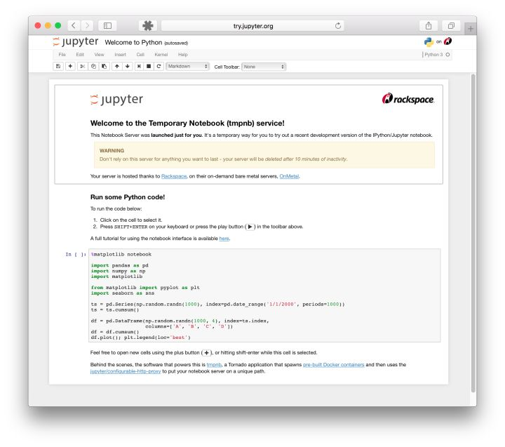

# 2.1 环境配置
本节简单介绍一些必要的软件的安装与配置，由于不同机器软硬件配置不同，所以不详述，遇到问题请善用Google。
## 2.1.1 Anaconda
Anaconda是Python的一个开源发行版本，主要面向科学计算。我们可以简单理解为，Anaconda是一个预装了很多我们用的到或用不到的第三方库的Python。而且相比于大家熟悉的pip install命令，Anaconda中增加了conda install命令。当你熟悉了Anaconda以后会发现，conda install会比pip install更方便一些。
强烈建议先去看看[最省心的Python版本和第三方库管理——初探Anaconda](https://zhuanlan.zhihu.com/p/25198543)和[初学 Python 者自学 Anaconda 的正确姿势-猴子的回答](https://www.zhihu.com/question/58033789/answer/254673663)。 

总的来说，我们应该完成以下几步：
* 根据操作系统下载并安装Anaconda（或者mini版本Miniconda）并学会常用的几个conda命令，例如如何管理python环境、如何安装卸载包等；
* Anaconda安装成功之后，我们需要修改其包管理镜像为国内源，这样以后安装包时就会快一些。

## 2.1.2 Jupyter
在没有notebook之前，在IT领域是这样工作的：在普通的 Python shell 或者在IDE（集成开发环境）如Pycharm中写代码，然后在word中写文档来说明你的项目。这个过程很繁琐，通常是写完代码，再写文档的时候我还的重头回顾一遍代码。最蛋疼的地方在于，有些数据分析的中间结果，还得重新跑代码，然后把结果弄到文档里给客户看。有了notebook之后，世界突然美好了许多，因为notebook可以直接在代码旁写出叙述性文档，而不是另外编写单独的文档。也就是它可以能将代码、文档等这一切集中到一处，让用户一目了然。如下图所示。
<div align=center>

</div>

Jupyter Notebook 已迅速成为数据分析，机器学习的必备工具。因为它可以让数据分析师集中精力向用户解释整个分析过程。

我们参考[jupyter notebook-猴子的回答](https://www.zhihu.com/question/46309360/answer/254638807)进行jupyter notebook及常用包（例如环境自动关联包nb_conda）的安装。

安装好后，我们使用以下命令打开一个jupyter notebook:
``` shell
jupyter notebook 
```
这时在浏览器打开 http://localhost:8888 （通常会自动打开）位于当前目录的jupyter服务。

## 2.1.3 PyTorch
由于本文需要用到PyTorch框架，所以还需要安装PyTorch（后期必不可少地会使用GPU，所以安装GPU版本的）。直接去[PyTorch官网](https://pytorch.org/)找到自己的软硬件对应的安装命令即可（这里不得不吹一下[PyTorch的官方文档](https://pytorch.org/tutorials/)，从安装到入门，深入浅出，比tensorflow不知道高到哪里去了）。安装好后使用以下命令可查看安装的PyTorch及版本号。
``` shell
conda list | grep torch
```

## 2.1.4 其他
此外还可以安装python最好用的IDE [PyCharm](https://www.jetbrains.com/pycharm/)，专业版的应该是需要收费的，但学生用户可以申请免费使用（[传送门](https://www.jetbrains.com/zh/student/)），或者直接用免费的社区版。

如果不喜欢用IDE也可以选择编辑器，例如VSCode等。


本节与原文有很大不同，[原文传送门](https://zh.d2l.ai/chapter_prerequisite/install.html)
