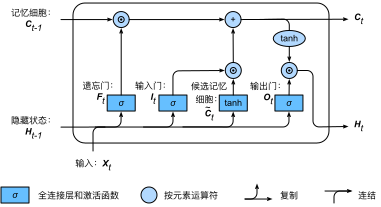

# 6.8 长短期记忆（LSTM）

本节将介绍另一种常用的门控循环神经网络：长短期记忆（long short-term memory，LSTM）[1]。它比门控循环单元的结构稍微复杂一点。

## 6.8.1 长短期记忆

LSTM 中引入了3个门，即输入门（input gate）、遗忘门（forget gate）和输出门（output gate），以及与隐藏状态形状相同的记忆细胞（某些文献把记忆细胞当成一种特殊的隐藏状态），从而记录额外的信息。


### 6.8.1.1 输入门、遗忘门和输出门

与门控循环单元中的重置门和更新门一样，如图6.7所示，长短期记忆的门的输入均为当前时间步输入$\boldsymbol{X}_t$与上一时间步隐藏状态$\boldsymbol{H}_{t-1}$，输出由激活函数为sigmoid函数的全连接层计算得到。如此一来，这3个门元素的值域均为$[0,1]$。

<div align=center>

</div>
<div align=center>图6.7 长短期记忆中输入门、遗忘门和输出门的计算</div>

具体来说，假设隐藏单元个数为$h$，给定时间步$t$的小批量输入$\boldsymbol{X}_t \in \mathbb{R}^{n \times d}$（样本数为$n$，输入个数为$d$）和上一时间步隐藏状态$\boldsymbol{H}_{t-1} \in \mathbb{R}^{n \times h}$。
时间步$t$的输入门$\boldsymbol{I}_t \in \mathbb{R}^{n \times h}$、遗忘门$\boldsymbol{F}_t \in \mathbb{R}^{n \times h}$和输出门$\boldsymbol{O}_t \in \mathbb{R}^{n \times h}$分别计算如下：

$$
\begin{aligned}
\boldsymbol{I}_t &= \sigma(\boldsymbol{X}_t \boldsymbol{W}_{xi} + \boldsymbol{H}_{t-1} \boldsymbol{W}_{hi} + \boldsymbol{b}_i),\\
\boldsymbol{F}_t &= \sigma(\boldsymbol{X}_t \boldsymbol{W}_{xf} + \boldsymbol{H}_{t-1} \boldsymbol{W}_{hf} + \boldsymbol{b}_f),\\
\boldsymbol{O}_t &= \sigma(\boldsymbol{X}_t \boldsymbol{W}_{xo} + \boldsymbol{H}_{t-1} \boldsymbol{W}_{ho} + \boldsymbol{b}_o),
\end{aligned}
$$

其中的$\boldsymbol{W}_{xi}, \boldsymbol{W}_{xf}, \boldsymbol{W}_{xo} \in \mathbb{R}^{d \times h}$和$\boldsymbol{W}_{hi}, \boldsymbol{W}_{hf}, \boldsymbol{W}_{ho} \in \mathbb{R}^{h \times h}$是权重参数，$\boldsymbol{b}_i, \boldsymbol{b}_f, \boldsymbol{b}_o \in \mathbb{R}^{1 \times h}$是偏差参数。


### 6.8.1.2 候选记忆细胞

接下来，长短期记忆需要计算候选记忆细胞$\tilde{\boldsymbol{C}}_t$。它的计算与上面介绍的3个门类似，但使用了值域在$[-1, 1]$的tanh函数作为激活函数，如图6.8所示。

<div align=center>

</div>
<div align=center>图6.8 长短期记忆中候选记忆细胞的计算</div>


具体来说，时间步$t$的候选记忆细胞$\tilde{\boldsymbol{C}}_t \in \mathbb{R}^{n \times h}$的计算为

$$
\tilde{\boldsymbol{C}}_t = \text{tanh}(\boldsymbol{X}_t \boldsymbol{W}_{xc} + \boldsymbol{H}_{t-1} \boldsymbol{W}_{hc} + \boldsymbol{b}_c),
$$

其中$\boldsymbol{W}_{xc} \in \mathbb{R}^{d \times h}$和$\boldsymbol{W}_{hc} \in \mathbb{R}^{h \times h}$是权重参数，$\boldsymbol{b}_c \in \mathbb{R}^{1 \times h}$是偏差参数。


### 6.8.1.3 记忆细胞

我们可以通过元素值域在$[0, 1]$的输入门、遗忘门和输出门来控制隐藏状态中信息的流动，这一般也是通过使用按元素乘法（符号为$\odot$）来实现的。当前时间步记忆细胞$\boldsymbol{C}_t \in \mathbb{R}^{n \times h}$的计算组合了上一时间步记忆细胞和当前时间步候选记忆细胞的信息，并通过遗忘门和输入门来控制信息的流动：

$$\boldsymbol{C}_t = \boldsymbol{F}_t \odot \boldsymbol{C}_{t-1} + \boldsymbol{I}_t \odot \tilde{\boldsymbol{C}}_t.$$


如图6.9所示，遗忘门控制上一时间步的记忆细胞$\boldsymbol{C}_{t-1}$中的信息是否传递到当前时间步，而输入门则控制当前时间步的输入$\boldsymbol{X}_t$通过候选记忆细胞$\tilde{\boldsymbol{C}}_t$如何流入当前时间步的记忆细胞。如果遗忘门一直近似1且输入门一直近似0，过去的记忆细胞将一直通过时间保存并传递至当前时间步。这个设计可以应对循环神经网络中的梯度衰减问题，并更好地捕捉时间序列中时间步距离较大的依赖关系。

<div align=center>

</div>
<div align=center>图6.9 长短期记忆中记忆细胞的计算</div>


### 6.8.1.4 隐藏状态

有了记忆细胞以后，接下来我们还可以通过输出门来控制从记忆细胞到隐藏状态$\boldsymbol{H}_t \in \mathbb{R}^{n \times h}$的信息的流动：

$$\boldsymbol{H}_t = \boldsymbol{O}_t \odot \text{tanh}(\boldsymbol{C}_t).$$

这里的tanh函数确保隐藏状态元素值在-1到1之间。需要注意的是，当输出门近似1时，记忆细胞信息将传递到隐藏状态供输出层使用；当输出门近似0时，记忆细胞信息只自己保留。图6.10展示了长短期记忆中隐藏状态的计算。

<div align=center>

</div>
<div align=center>图6.10 长短期记忆中隐藏状态的计算</div>


## 6.8.2 读取数据集

下面我们开始实现并展示长短期记忆。和前几节中的实验一样，这里依然使用周杰伦歌词数据集来训练模型作词。

``` python
import numpy as np
import torch
from torch import nn, optim
import torch.nn.functional as F

import sys
sys.path.append("..") 
import d2lzh_pytorch as d2l
device = torch.device('cuda' if torch.cuda.is_available() else 'cpu')

(corpus_indices, char_to_idx, idx_to_char, vocab_size) = d2l.load_data_jay_lyrics()
```

## 6.8.3 从零开始实现

我们先介绍如何从零开始实现长短期记忆。

### 6.8.3.1 初始化模型参数

下面的代码对模型参数进行初始化。超参数`num_hiddens`定义了隐藏单元的个数。

``` python
num_inputs, num_hiddens, num_outputs = vocab_size, 256, vocab_size
print('will use', device)

def get_params():
    def _one(shape):
        ts = torch.tensor(np.random.normal(0, 0.01, size=shape), device=device, dtype=torch.float32)
        return torch.nn.Parameter(ts, requires_grad=True)
    def _three():
        return (_one((num_inputs, num_hiddens)),
                _one((num_hiddens, num_hiddens)),
                torch.nn.Parameter(torch.zeros(num_hiddens, device=device, dtype=torch.float32), requires_grad=True))
    
    W_xi, W_hi, b_i = _three()  # 输入门参数
    W_xf, W_hf, b_f = _three()  # 遗忘门参数
    W_xo, W_ho, b_o = _three()  # 输出门参数
    W_xc, W_hc, b_c = _three()  # 候选记忆细胞参数
    
    # 输出层参数
    W_hq = _one((num_hiddens, num_outputs))
    b_q = torch.nn.Parameter(torch.zeros(num_outputs, device=device, dtype=torch.float32), requires_grad=True)
    return nn.ParameterList([W_xi, W_hi, b_i, W_xf, W_hf, b_f, W_xo, W_ho, b_o, W_xc, W_hc, b_c, W_hq, b_q])
```

## 6.8.4 定义模型

在初始化函数中，长短期记忆的隐藏状态需要返回额外的形状为(批量大小, 隐藏单元个数)的值为0的记忆细胞。

``` python
def init_lstm_state(batch_size, num_hiddens, device):
    return (torch.zeros((batch_size, num_hiddens), device=device), 
            torch.zeros((batch_size, num_hiddens), device=device))
```

下面根据长短期记忆的计算表达式定义模型。需要注意的是，只有隐藏状态会传递到输出层，而记忆细胞不参与输出层的计算。

``` python
def lstm(inputs, state, params):
    [W_xi, W_hi, b_i, W_xf, W_hf, b_f, W_xo, W_ho, b_o, W_xc, W_hc, b_c, W_hq, b_q] = params
    (H, C) = state
    outputs = []
    for X in inputs:
        I = torch.sigmoid(torch.matmul(X, W_xi) + torch.matmul(H, W_hi) + b_i)
        F = torch.sigmoid(torch.matmul(X, W_xf) + torch.matmul(H, W_hf) + b_f)
        O = torch.sigmoid(torch.matmul(X, W_xo) + torch.matmul(H, W_ho) + b_o)
        C_tilda = torch.tanh(torch.matmul(X, W_xc) + torch.matmul(H, W_hc) + b_c)
        C = F * C + I * C_tilda
        H = O * C.tanh()
        Y = torch.matmul(H, W_hq) + b_q
        outputs.append(Y)
    return outputs, (H, C)
```

### 6.8.4.1 训练模型并创作歌词

同上一节一样，我们在训练模型时只使用相邻采样。设置好超参数后，我们将训练模型并根据前缀“分开”和“不分开”分别创作长度为50个字符的一段歌词。

``` python
num_epochs, num_steps, batch_size, lr, clipping_theta = 160, 35, 32, 1e2, 1e-2
pred_period, pred_len, prefixes = 40, 50, ['分开', '不分开']
```

我们每过40个迭代周期便根据当前训练的模型创作一段歌词。

``` python
d2l.train_and_predict_rnn(lstm, get_params, init_lstm_state, num_hiddens,
                          vocab_size, device, corpus_indices, idx_to_char,
                          char_to_idx, False, num_epochs, num_steps, lr,
                          clipping_theta, batch_size, pred_period, pred_len,
                          prefixes)
```
输出：
```
epoch 40, perplexity 211.416571, time 1.37 sec
 - 分开 我不的我 我不的我 我不的我 我不的我 我不的我 我不的我 我不的我 我不的我 我不的我 我不的我
 - 不分开 我不的我 我不的我 我不的我 我不的我 我不的我 我不的我 我不的我 我不的我 我不的我 我不的我
epoch 80, perplexity 67.048346, time 1.35 sec
 - 分开 我想你你 我不要再想 我不要这我 我不要这我 我不要这我 我不要这我 我不要这我 我不要这我 我不
 - 不分开 我想你你想你 我不要这不样 我不要这我 我不要这我 我不要这我 我不要这我 我不要这我 我不要这我
epoch 120, perplexity 15.552743, time 1.36 sec
 - 分开 我想带你的微笑 像这在 你想我 我想你 说你我 说你了 说给怎么么 有你在空 你在在空 在你的空 
 - 不分开 我想要你已经堡 一样样 说你了 我想就这样着你 不知不觉 你已了离开活 后知后觉 我该了这生活 我
epoch 160, perplexity 4.274031, time 1.35 sec
 - 分开 我想带你 你不一外在半空 我只能够远远著她 这些我 你想我难难头 一话看人对落我一望望我 我不那这
 - 不分开 我想你这生堡 我知好烦 你不的节我 后知后觉 我该了这节奏 后知后觉 又过了一个秋 后知后觉 我该
```

## 6.8.5 简洁实现

在Gluon中我们可以直接调用`rnn`模块中的`LSTM`类。

``` python
lr = 1e-2 # 注意调整学习率
lstm_layer = nn.LSTM(input_size=vocab_size, hidden_size=num_hiddens)
model = d2l.RNNModel(lstm_layer, vocab_size)
d2l.train_and_predict_rnn_pytorch(model, num_hiddens, vocab_size, device,
                                corpus_indices, idx_to_char, char_to_idx,
                                num_epochs, num_steps, lr, clipping_theta,
                                batch_size, pred_period, pred_len, prefixes)
```
输出：
```
epoch 40, perplexity 1.020401, time 1.54 sec
 - 分开始想担 妈跟我 一定是我妈在 因为分手前那句抱歉 在感动 穿梭时间的画面的钟 从反方向开始移动 回到
 - 不分开始想像 妈跟我 我将我的寂寞封闭 然后在这里 不限日期 然后将过去 慢慢温习 让我爱上你 那场悲剧 
epoch 80, perplexity 1.011164, time 1.34 sec
 - 分开始想担 你的 从前的可爱女人 温柔的让我心疼的可爱女人 透明的让我感动的可爱女人 坏坏的让我疯狂的可
 - 不分开 我满了 让我疯狂的可爱女人 漂亮的让我面红的可爱女人 温柔的让我心疼的可爱女人 透明的让我感动的可
epoch 120, perplexity 1.025348, time 1.39 sec
 - 分开始共渡每一天 手牵手 一步两步三步四步望著天 看星星 一颗两颗三颗四颗 连成线背著背默默许下心愿 看
 - 不分开 我不懂 说了没用 他的笑容 有何不同 在你心中 我不再受宠 我的天空 是雨是风 还是彩虹 你在操纵
epoch 160, perplexity 1.017492, time 1.42 sec
 - 分开始乡相信命运 感谢地心引力 让我碰到你 漂亮的让我面红的可爱女人 温柔的让我心疼的可爱女人 透明的让
 - 不分开 我不能再想 我不 我不 我不能 爱情走的太快就像龙卷风 不能承受我已无处可躲 我不要再想 我不要再
```


## 小结

* 长短期记忆的隐藏层输出包括隐藏状态和记忆细胞。只有隐藏状态会传递到输出层。
* 长短期记忆的输入门、遗忘门和输出门可以控制信息的流动。
* 长短期记忆可以应对循环神经网络中的梯度衰减问题，并更好地捕捉时间序列中时间步距离较大的依赖关系。


## 参考文献

[1] Hochreiter, S., & Schmidhuber, J. (1997). Long short-term memory. Neural computation, 9(8), 1735-1780.


-----------
> 注：除代码外本节与原书此节基本相同，[原书传送门](https://zh.d2l.ai/chapter_recurrent-neural-networks/lstm.html)

