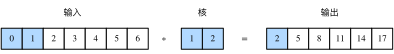
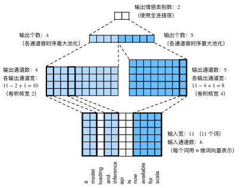

# 10.8 文本情感分类：使用卷积神经网络（textCNN）

在“卷积神经网络”一章中我们探究了如何使用二维卷积神经网络来处理二维图像数据。在之前的语言模型和文本分类任务中，我们将文本数据看作是只有一个维度的时间序列，并很自然地使用循环神经网络来表征这样的数据。其实，我们也可以将文本当作一维图像，从而可以用一维卷积神经网络来捕捉临近词之间的关联。本节将介绍将卷积神经网络应用到文本分析的开创性工作之一：textCNN [1]。

首先导入实验所需的包和模块。

``` python
import os
import torch
from torch import nn
import torchtext.vocab as Vocab
import torch.utils.data as Data
import  torch.nn.functional as F

import sys
sys.path.append("..") 
import d2lzh_pytorch as d2l

os.environ["CUDA_VISIBLE_DEVICES"] = "0"
device = torch.device('cuda' if torch.cuda.is_available() else 'cpu')

DATA_ROOT = "/S1/CSCL/tangss/Datasets"
```

## 10.8.1 一维卷积层

在介绍模型前我们先来解释一维卷积层的工作原理。与二维卷积层一样，一维卷积层使用一维的互相关运算。在一维互相关运算中，卷积窗口从输入数组的最左方开始，按从左往右的顺序，依次在输入数组上滑动。当卷积窗口滑动到某一位置时，窗口中的输入子数组与核数组按元素相乘并求和，得到输出数组中相应位置的元素。如图10.4所示，输入是一个宽为7的一维数组，核数组的宽为2。可以看到输出的宽度为$7-2+1=6$，且第一个元素是由输入的最左边的宽为2的子数组与核数组按元素相乘后再相加得到的：$0\times1+1\times2=2$。

<div align=center>

</div>
<div align=center>图10.4 一维互相关运算</div>

下面我们将一维互相关运算实现在`corr1d`函数里。它接受输入数组`X`和核数组`K`，并输出数组`Y`。

``` python
def corr1d(X, K):
    w = K.shape[0]
    Y = torch.zeros((X.shape[0] - w + 1))
    for i in range(Y.shape[0]):
        Y[i] = (X[i: i + w] * K).sum()
    return Y
```

让我们复现图10.4中一维互相关运算的结果。

``` python
X, K = torch.tensor([0, 1, 2, 3, 4, 5, 6]), torch.tensor([1, 2])
corr1d(X, K)
```
输出：
```
tensor([ 2.,  5.,  8., 11., 14., 17.])
```

多输入通道的一维互相关运算也与多输入通道的二维互相关运算类似：在每个通道上，将核与相应的输入做一维互相关运算，并将通道之间的结果相加得到输出结果。图10.5展示了含3个输入通道的一维互相关运算，其中阴影部分为第一个输出元素及其计算所使用的输入和核数组元素：$0\times1+1\times2+1\times3+2\times4+2\times(-1)+3\times(-3)=2$。

<div align=center>

</div>
<div align=center>图10.5 含3个输入通道的一维互相关运算</div>

让我们复现图10.5中多输入通道的一维互相关运算的结果。

``` python
def corr1d_multi_in(X, K):
    # 首先沿着X和K的第0维（通道维）遍历并计算一维互相关结果。然后将所有结果堆叠起来沿第0维累加
    return torch.stack([corr1d(x, k) for x, k in zip(X, K)]).sum(dim=0)

X = torch.tensor([[0, 1, 2, 3, 4, 5, 6],
              [1, 2, 3, 4, 5, 6, 7],
              [2, 3, 4, 5, 6, 7, 8]])
K = torch.tensor([[1, 2], [3, 4], [-1, -3]])
corr1d_multi_in(X, K)
```
输出：
```
tensor([ 2.,  8., 14., 20., 26., 32.])
```

由二维互相关运算的定义可知，多输入通道的一维互相关运算可以看作单输入通道的二维互相关运算。如图10.6所示，我们也可以将图10.5中多输入通道的一维互相关运算以等价的单输入通道的二维互相关运算呈现。这里核的高等于输入的高。图10.6中的阴影部分为第一个输出元素及其计算所使用的输入和核数组元素：$2\times(-1)+3\times(-3)+1\times3+2\times4+0\times1+1\times2=2$。

<div align=center>

</div>
<div align=center>图10.6 单输入通道的二维互相关运算</div>

图10.4和图10.5中的输出都只有一个通道。我们在5.3节（多输入通道和多输出通道）一节中介绍了如何在二维卷积层中指定多个输出通道。类似地，我们也可以在一维卷积层指定多个输出通道，从而拓展卷积层中的模型参数。


## 10.8.2 时序最大池化层

类似地，我们有一维池化层。textCNN中使用的时序最大池化（max-over-time pooling）层实际上对应一维全局最大池化层：假设输入包含多个通道，各通道由不同时间步上的数值组成，各通道的输出即该通道所有时间步中最大的数值。因此，时序最大池化层的输入在各个通道上的时间步数可以不同。

为提升计算性能，我们常常将不同长度的时序样本组成一个小批量，并通过在较短序列后附加特殊字符（如0）令批量中各时序样本长度相同。这些人为添加的特殊字符当然是无意义的。由于时序最大池化的主要目的是抓取时序中最重要的特征，它通常能使模型不受人为添加字符的影响。

由于PyTorch没有自带全局的最大池化层，所以类似5.8节我们可以通过普通的池化来实现全局池化。
``` python
class GlobalMaxPool1d(nn.Module):
    def __init__(self):
        super(GlobalMaxPool1d, self).__init__()
    def forward(self, x):
         # x shape: (batch_size, channel, seq_len)
         # return shape: (batch_size, channel, 1)
        return F.max_pool1d(x, kernel_size=x.shape[2])
```

## 10.8.3 读取和预处理IMDb数据集

我们依然使用和上一节中相同的IMDb数据集做情感分析。以下读取和预处理数据集的步骤与上一节中的相同。

``` python
batch_size = 64
train_data = d2l.read_imdb('train', data_root=os.path.join(DATA_ROOT, "aclImdb"))
test_data = d2l.read_imdb('test', data_root=os.path.join(DATA_ROOT, "aclImdb"))
vocab = d2l.get_vocab_imdb(train_data)
train_set = Data.TensorDataset(*d2l.preprocess_imdb(train_data, vocab))
test_set = Data.TensorDataset(*d2l.preprocess_imdb(test_data, vocab))
train_iter = Data.DataLoader(train_set, batch_size, shuffle=True)
test_iter = Data.DataLoader(test_set, batch_size)
```

## 10.8.4 textCNN模型

textCNN模型主要使用了一维卷积层和时序最大池化层。假设输入的文本序列由$n$个词组成，每个词用$d$维的词向量表示。那么输入样本的宽为$n$，高为1，输入通道数为$d$。textCNN的计算主要分为以下几步。

1. 定义多个一维卷积核，并使用这些卷积核对输入分别做卷积计算。宽度不同的卷积核可能会捕捉到不同个数的相邻词的相关性。
2. 对输出的所有通道分别做时序最大池化，再将这些通道的池化输出值连结为向量。
3. 通过全连接层将连结后的向量变换为有关各类别的输出。这一步可以使用丢弃层应对过拟合。

图10.7用一个例子解释了textCNN的设计。这里的输入是一个有11个词的句子，每个词用6维词向量表示。因此输入序列的宽为11，输入通道数为6。给定2个一维卷积核，核宽分别为2和4，输出通道数分别设为4和5。因此，一维卷积计算后，4个输出通道的宽为$11-2+1=10$，而其他5个通道的宽为$11-4+1=8$。尽管每个通道的宽不同，我们依然可以对各个通道做时序最大池化，并将9个通道的池化输出连结成一个9维向量。最终，使用全连接将9维向量变换为2维输出，即正面情感和负面情感的预测。

<div align=center>

</div>
<div align=center>图10.7 textCNN的设计</div>


下面我们来实现textCNN模型。与上一节相比，除了用一维卷积层替换循环神经网络外，这里我们还使用了两个嵌入层，一个的权重固定，另一个则参与训练。

``` python
class TextCNN(nn.Module):
    def __init__(self, vocab, embed_size, kernel_sizes, num_channels):
        super(TextCNN, self).__init__()
        self.embedding = nn.Embedding(len(vocab), embed_size)
        # 不参与训练的嵌入层
        self.constant_embedding = nn.Embedding(len(vocab), embed_size)
        self.dropout = nn.Dropout(0.5)
        self.decoder = nn.Linear(sum(num_channels), 2)
        # 时序最大池化层没有权重，所以可以共用一个实例
        self.pool = GlobalMaxPool1d()
        self.convs = nn.ModuleList()  # 创建多个一维卷积层
        for c, k in zip(num_channels, kernel_sizes):
            self.convs.append(nn.Conv1d(in_channels = 2*embed_size, 
                                        out_channels = c, 
                                        kernel_size = k))

    def forward(self, inputs):
        # 将两个形状是(批量大小, 词数, 词向量维度)的嵌入层的输出按词向量连结
        embeddings = torch.cat((
            self.embedding(inputs), 
            self.constant_embedding(inputs)), dim=2) # (batch, seq_len, 2*embed_size)
        # 根据Conv1D要求的输入格式，将词向量维，即一维卷积层的通道维(即词向量那一维)，变换到前一维
        embeddings = embeddings.permute(0, 2, 1)
        # 对于每个一维卷积层，在时序最大池化后会得到一个形状为(批量大小, 通道大小, 1)的
        # Tensor。使用flatten函数去掉最后一维，然后在通道维上连结
        encoding = torch.cat([self.pool(F.relu(conv(embeddings))).squeeze(-1) for conv in self.convs], dim=1)
        # 应用丢弃法后使用全连接层得到输出
        outputs = self.decoder(self.dropout(encoding))
        return outputs
```

创建一个`TextCNN`实例。它有3个卷积层，它们的核宽分别为3、4和5，输出通道数均为100。

``` python
embed_size, kernel_sizes, nums_channels = 100, [3, 4, 5], [100, 100, 100]
net = TextCNN(vocab, embed_size, kernel_sizes, nums_channels)
```

### 10.8.4.1 加载预训练的词向量

同上一节一样，加载预训练的100维GloVe词向量，并分别初始化嵌入层`embedding`和`constant_embedding`，前者参与训练，而后者权重固定。

``` python
glove_vocab = Vocab.GloVe(name='6B', dim=100,
                        cache=os.path.join(DATA_ROOT, "glove"))
net.embedding.weight.data.copy_(
    d2l.load_pretrained_embedding(vocab.itos, glove_vocab))
net.constant_embedding.weight.data.copy_(
    d2l.load_pretrained_embedding(vocab.itos, glove_vocab))
net.constant_embedding.weight.requires_grad = False
```

### 10.8.4.2 训练并评价模型

现在就可以训练模型了。

``` python
lr, num_epochs = 0.001, 5
optimizer = torch.optim.Adam(filter(lambda p: p.requires_grad, net.parameters()), lr=lr)
loss = nn.CrossEntropyLoss()
d2l.train(train_iter, test_iter, net, loss, optimizer, device, num_epochs)
```
输出：
```
training on  cuda
epoch 1, loss 0.4858, train acc 0.758, test acc 0.832, time 42.8 sec
epoch 2, loss 0.1598, train acc 0.863, test acc 0.868, time 42.3 sec
epoch 3, loss 0.0694, train acc 0.917, test acc 0.876, time 42.3 sec
epoch 4, loss 0.0301, train acc 0.956, test acc 0.871, time 42.4 sec
epoch 5, loss 0.0131, train acc 0.979, test acc 0.865, time 42.3 sec
```

下面，我们使用训练好的模型对两个简单句子的情感进行分类。

``` python 
d2l.predict_sentiment(net, vocab, ['this', 'movie', 'is', 'so', 'great']) # positive
```

``` python
d2l.predict_sentiment(net, vocab, ['this', 'movie', 'is', 'so', 'bad']) # negative
```

## 小结

* 可以使用一维卷积来表征时序数据。
* 多输入通道的一维互相关运算可以看作单输入通道的二维互相关运算。
* 时序最大池化层的输入在各个通道上的时间步数可以不同。
* textCNN主要使用了一维卷积层和时序最大池化层。


## 参考文献

[1] Kim, Y. (2014). Convolutional neural networks for sentence classification. arXiv preprint arXiv:1408.5882.


-----------
> 注：本节除代码外与原书基本相同，[原书传送门](https://zh.d2l.ai/chapter_natural-language-processing/sentiment-analysis-cnn.html)
